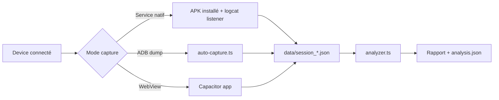

# ECHA — Instagram Content Intelligence

## Quick Reference

```bash
# Devices
npm run devices          # Scan connected devices + save .env.devices
npm run devices:wifi     # Enable ADB WiFi
npm run devices:list     # Show saved devices

# Capture (nécessite device + Instagram ouvert)
npx tsx src/index.ts [scrolls]       # Dump accessibility tree (ponctuel)
npx tsx src/capture.ts [seconds]     # Écoute logcat AccessibilityService (temps réel)
npx tsx src/auto-capture.ts [n] [ms] # Auto-scroll + screenshot + dump UI

# Analyse
npx tsx src/analyzer.ts [session.json]  # Analyse complète + auto-ingest SQLite

# Database
npm run db:migrate       # Appliquer migrations Prisma
npm run db:generate      # Régénérer le client Prisma
npm run db:ingest        # Ingérer toutes les sessions analysées dans SQLite

# Enrichissement
npx tsx src/enrich.ts                    # Enrichir (Ollama, batch 20)
npx tsx src/enrich.ts --openai           # Enrichir via OpenAI
npx tsx src/enrich.ts --rules-only       # Rules seulement (pas de LLM)
npx tsx src/enrich.ts --with-audio       # + transcription audio vidéos (Whisper local)
npx tsx src/enrich.ts --whisper-api      # + transcription via Whisper API (OpenAI)

# Visualizer (debug)
npm run visualizer       # Lance le dashboard debug sur http://localhost:3000

# APK
npm run apk:install -- <path.apk>    # Install APK sur tous les devices
```

## Vision

ECHA capture et analyse l'activité Instagram d'un utilisateur pour produire un **rapport structuré** de sa consommation : quels contenus vus, combien de temps sur chacun, quelle catégorie, quelle origine (organique/algo/pub).

**Objectif final** : workflow complet **capture → enrichissement sémantique → scoring politique/polarisation → profil utilisateur** avec pipeline documentaire complet.

## Roadmap

Voir [`docs/ROADMAP.md`](docs/ROADMAP.md) pour le plan détaillé du MVP en 2 niveaux :
- **Niveau post** : enrichissement sémantique, scoring politique (0-4), polarisation (0-1), narratif, confiance
- **Niveau utilisateur** : agrégation 7j/30j/90j, profils de consommation, indices de diversité

### État d'avancement vs Roadmap
- **Phase 0 (cadrage)** : ✅ fait — périmètre, taxonomie, schéma Prisma
- **Phase 1 (audit data)** : ✅ fait — capture fonctionnelle, sessions collectées, champs mappés
- **Phase 2 (design modèle post)** : 🔶 partiel — `PostSemantic` existe mais ne couvre pas tout le spec `post_enriched`
- **Phase 3 (implémentation post)** : 🔶 partiel — catégorisation regex (16 catégories), pas de LLM/scoring politique/polarisation
- **Phase 4-8** : ❌ à faire

## Stack

| Composant | Technologie | Rôle |
|-----------|-------------|------|
| Scripts capture/analyse | TypeScript + tsx | Orchestration ADB, parsing, reporting |
| Service Android natif | Java (AccessibilityService) | Extraction arbre accessibilité Instagram |
| App Capacitor | Capacitor 8 + Android | WebView avec injection JS tracker |
| WebView tracker | JavaScript vanilla | DOM parsing + IntersectionObserver + dwell time |
| ADB tools | platform-tools | Screenshots, UI dump, logcat |

## Architecture

```
echa/
├── src/                          # Scripts TypeScript (PC-side)
│   ├── index.ts                  # Dump ponctuel accessibilité
│   ├── capture.ts                # Écoute temps réel logcat ECHA_DATA
│   ├── auto-capture.ts           # Auto-scroll + screenshot + dump
│   ├── analyzer.ts               # Analyse session: extraction, catégorisation, attention
│   ├── parser.ts                 # Parsing XML UIAutomator
│   ├── deep-extract.ts           # Extraction enrichie (image descriptions)
│   ├── adb.ts                    # Wrapper ADB commands
│   ├── adb-path.ts               # Résolution chemin ADB
│   ├── logcat-listener.ts        # Écoute logcat AccessibilityService
│   ├── logcat-tap.ts             # EventEmitter logcat (ECHA_DATA + ECHA_MLKIT)
│   ├── listen.ts                 # Entry point listener
│   ├── ingest-all.ts             # Ingestion batch sessions → SQLite
│   ├── db/
│   │   ├── client.ts             # Prisma client (better-sqlite3 adapter)
│   │   └── ingest.ts             # Pipeline _analysis.json → SQLite
│   ├── media/
│   │   ├── download.ts           # Téléchargement vidéo depuis URL CDN
│   │   ├── audio-extract.ts      # Extraction audio via ffmpeg
│   │   ├── transcribe.ts         # Abstraction Whisper (local + API)
│   │   └── pipeline.ts           # Orchestration download → extract → transcribe
│   └── visualizer/
│       ├── server.ts             # HTTP + WebSocket + live ingest
│       ├── api.ts                # REST API (sessions, posts, stats)
│       └── public/
│           ├── index.html        # Dashboard debug (6 panneaux)
│           └── dashboard.js      # Client WS + rendu DOM
├── echa-android/                 # APK AccessibilityService (Java)
│   └── app/src/main/java/com/lab/echa/
│       ├── InstagramAccessibilityService.java  # Service principal
│       ├── NodeExtractor.java                  # Extraction arbre nodes
│       └── PostTracker.java                    # Tracking posts + dwell time
├── echa-app/                     # App Capacitor (WebView)
│   ├── capacitor.config.ts       # Config Capacitor (appId: com.lab.echa.app)
│   ├── www/
│   │   ├── index.html            # Dashboard ECHA
│   │   └── tracker.js            # Script injecté dans WebView Instagram
│   └── android/                  # Projet Android généré par Capacitor
├── scripts/
│   └── scan-devices.ts           # Détection devices ADB + WiFi
├── data/                         # Sessions capturées, screenshots, rapports
└── package.json                  # Monorepo racine
```

## Modèle de données

### Session capturée (`data/session_*.json`)
```typescript
interface SessionFile {
  capturedAt: string;
  durationSec: number;
  totalEvents: number;
  events: RawEvent[];
}

interface RawEvent {
  timestamp: number;
  eventType: 'CONTENT_CHANGED' | 'SCROLLED' | 'STATE_CHANGED';
  screenType: 'feed' | 'profile' | 'reels' | 'unknown';
  nodeCount: number;
  focusedPostId: string;             // "username|hash"
  focusedPost: VisiblePost | null;
  visiblePosts: VisiblePost[];
  dwellTimes: Record<string, number>; // postId -> ms cumulé
  nodes: RawNode[];
  imageDescriptions: string[];
}
```

### Post analysé
```typescript
interface PostWithAttention {
  username: string;
  caption: string;
  imageDescription: string;          // Alt-text Instagram
  mediaType: 'photo' | 'video' | 'carousel' | 'reel';
  isSponsored: boolean;
  isSuggested: boolean;
  dwellTimeSec: number;
  attentionLevel: 'skipped' | 'glanced' | 'viewed' | 'engaged';
  contentCategory: string;           // 16 catégories (regex-based)
  hashtags: string[];
  likeCount: string;
  date: string;
}
```

### Niveaux d'attention
| Niveau | Durée | Signification |
|--------|-------|---------------|
| `skipped` | < 0.5s | Scrollé sans regarder |
| `glanced` | 0.5 - 2s | Vu rapidement |
| `viewed` | 2 - 5s | Consulté normalement |
| `engaged` | > 5s | Engagement fort (lecture, interaction) |

## 3 Modes de capture

### 1. AccessibilityService (APK natif)
- **Source** : arbre accessibilité Android de l'app Instagram native
- **Avantages** : fonctionne sur l'app réelle, dwell time natif, données riches
- **Limites** : nécessite APK installé + permission accessibilité
- **Communication** : logcat tag `ECHA_DATA`, chunks si > 3900 chars

### 2. ADB + UIAutomator (scripts PC)
- **Source** : `uiautomator dump` + `screencap` via ADB
- **Avantages** : pas d'APK, screenshots automatiques
- **Limites** : polling (pas temps réel), latence dump ~1s

### 3. WebView Capacitor (en cours)
- **Source** : DOM Instagram mobile web via WebView
- **Avantages** : accès DOM direct, IntersectionObserver natif, images URLs
- **Limites** : Instagram web != app native (contenu réduit), CORS images

## Catégorisation

16 catégories regex dans `analyzer.ts` :
`actualités/info`, `jeux/gaming`, `manga/anime/illustration`, `art/culture`, `créateurs/DIY`, `mode/luxe`, `voyage/géo`, `food/boisson`, `tech/science`, `humour/divertissement`, `sport/fitness`, `musique`, `immobilier/commerce`, `vie sociale/perso`, `nature/animaux`, `design/architecture`

Classification en 2 passes : primary blob (username+caption+hashtags) puis secondary blob (imageDescription+allText nettoyé).

## Device actuel

- **Modèle** : OnePlus Nord CE 3 Lite (CPH2449)
- **Serial** : `2d53431c`
- **IP WiFi** : `10.1.35.151`
- **ADB path** : `~/lab/platform-tools/adb.exe`

## Conventions

- **Langage** : TypeScript strict pour scripts, Java pour Android natif
- **Runtime** : `tsx` (pas ts-node)
- **Pas de framework frontend** dans l'app Capacitor (vanilla JS/HTML)
- **Data** : tout dans `data/` (gitignored), format JSON
- **Logs** : `[ISO timestamp] message` pour tous les scripts
- **ADB** : toujours utiliser `findAdbPath()` ou wrapper `adb.ts`
- **Nommage fichiers** : kebab-case pour TS, PascalCase pour Java
- **Tests** : chaque fix/feature doit avoir un test de confirmation

## Workflow de développement


