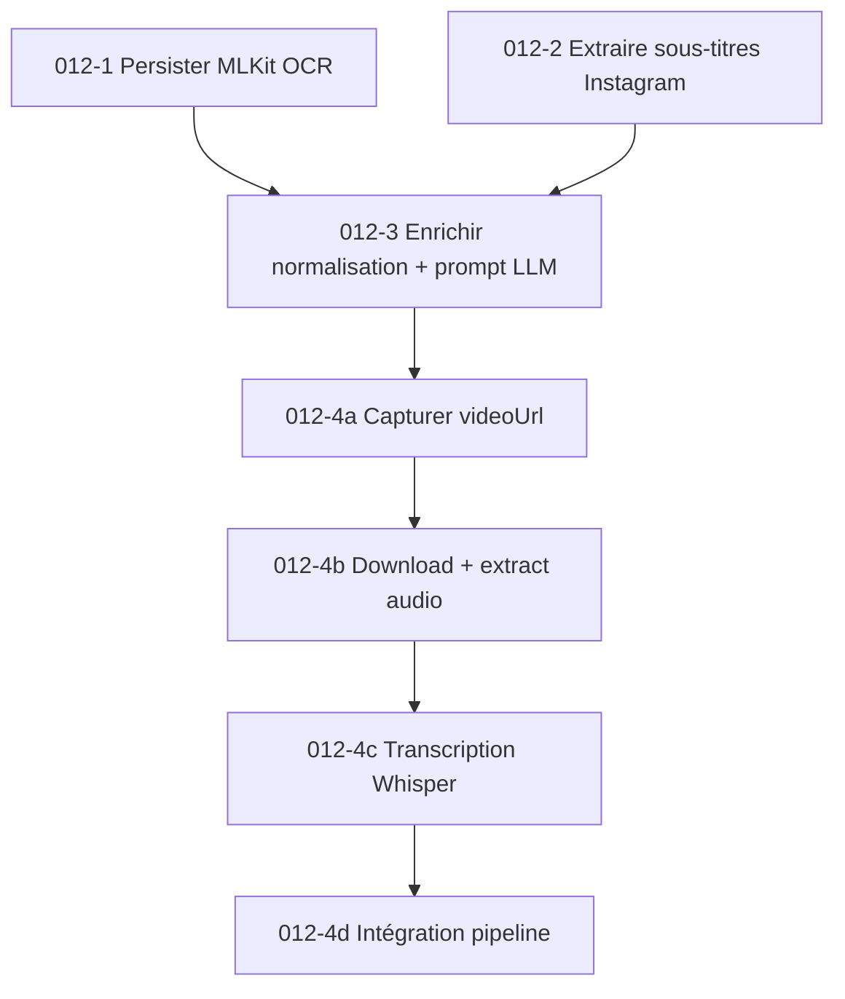
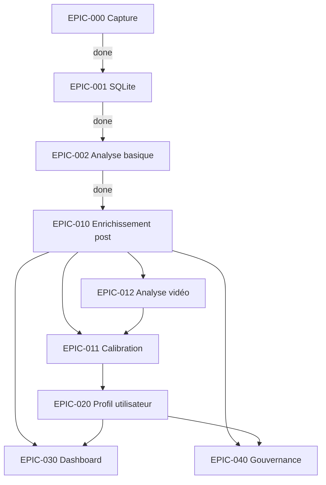

# ECHA — Roadmap Epics & Tasks

> Source de vérité pour le suivi d'avancement. Chaque epic correspond à un sprint du replan.
> Statuts : `done` | `in-progress` | `todo` | `blocked`

---

## EPIC-000 : Infrastructure de capture
**Statut** : `done`
**Description** : Capturer l'activité Instagram brute depuis un device Android.

| # | Tâche | Statut | Notes |
|---|-------|--------|-------|
| 000-1 | AccessibilityService Java (APK) | done | Logcat ECHA_DATA |
| 000-2 | Scripts ADB (dump UI, screenshot, auto-scroll) | done | `auto-capture.ts` |
| 000-3 | WebView Capacitor (tracker.js) | done | DOM parsing + IntersectionObserver |
| 000-4 | Logcat listener temps réel | done | `logcat-tap.ts` |
| 000-5 | Scan devices + WiFi ADB | done | `scan-devices.ts` |

---

## EPIC-001 : Data layer SQLite
**Statut** : `done`
**Description** : Stocker sessions et posts dans SQLite via Prisma.

| # | Tâche | Statut | Notes |
|---|-------|--------|-------|
| 001-1 | Schéma Prisma (Session, Post, PostSemantic) | done | `prisma/schema.prisma` |
| 001-2 | Pipeline ingestion _analysis.json → SQLite | done | `db/ingest.ts` |
| 001-3 | Auto-ingest depuis analyzer.ts | done | |
| 001-4 | Batch ingest-all.ts | done | |
| 001-5 | Visualizer debug (dashboard 6 panneaux) | done | `src/visualizer/` |

---

## EPIC-002 : Analyse basique posts
**Statut** : `done`
**Description** : Extraire et catégoriser les posts depuis les sessions brutes.

| # | Tâche | Statut | Notes |
|---|-------|--------|-------|
| 002-1 | Extraction posts depuis noeuds bruts | done | `analyzer.ts` |
| 002-2 | 16 catégories regex (2 passes) | done | primary + secondary blob |
| 002-3 | Calcul dwell time + attention levels | done | skipped/glanced/viewed/engaged |
| 002-4 | Rapport texte + JSON analysis | done | `_report.txt` + `_analysis.json` |

---

## EPIC-010 : Enrichissement post complet (`post_enriched`)
**Statut** : `done`
**Description** : Transformer chaque post brut en unité d'analyse sémantique et politique conforme au spec roadmap §6.

### Tâche 010-1 : Extension schéma Prisma
**Statut** : `done`

Étendre `PostSemantic` ou créer `PostEnriched` avec tous les champs cibles :
- `normalized_text` (consolidation caption+OCR+allText)
- `main_topics`, `secondary_topics` (JSON, multi-label)
- `content_domain`, `audience_target`
- `persons`, `organizations`, `political_actors` (JSON, entités nommées)
- `tone`, `primary_emotion`, `emotion_intensity`
- `political_explicitness_score` (Int 0-4)
- `political_issue_tags`, `public_policy_tags` (JSON)
- `institutional_reference_score` (Float)
- `activism_signal` (Bool)
- `polarization_score` (Float 0-1)
- `ingroup_outgroup_signal`, `conflict_signal`, `moral_absolute_signal`, `enemy_designation_signal` (Bool)
- `narrative_frame` (enum/string)
- `call_to_action_type` (enum/string)
- `problem_solution_pattern` (String)
- `confidence_score` (Float)
- `review_flag` (Bool)

### Tâche 010-2 : Dictionnaires et règles (couche 1)
**Statut** : `done`

Créer `src/enrichment/dictionaries/` :
- `political-actors.ts` — partis, élus, institutions FR
- `militant-hashtags.ts` — hashtags militants, causes, slogans
- `conflict-vocabulary.ts` — vocabulaire polarisant, indignation, opposition
- `topics-keywords.ts` — mots-clés par thème de la taxonomie (24 thèmes)

Créer `src/enrichment/rules-engine.ts` :
- Scoring politique rule-based (présence entités → score 0-4)
- Scoring polarisation rule-based (densité vocabulaire conflictuel → 0-1)
- Détection narratif simple (patterns textuels)

### Tâche 010-3 : Abstraction LLM + prompts (couche 2)
**Statut** : `done`

Créer `src/enrichment/llm/` :
- `provider.ts` — interface `LLMProvider` (call, models, cost)
- `openai.ts` — implémentation OpenAI (GPT-4o-mini)
- `ollama.ts` — implémentation Ollama (Llama 3 local)
- `prompts.ts` — prompt structuré pour enrichissement post :
  - résumé sémantique
  - classification multi-label (24 thèmes)
  - narratif (14 types)
  - portée politique (0-4) + justification
  - polarisation (0-1) + signaux détectés
  - entités nommées
  - appel à l'action (11 types)
  - confiance

### Tâche 010-4 : Consolidation texte (couche 4)
**Statut** : `done`

Créer `src/enrichment/normalize.ts` :
- Fusion caption + imageDesc (alt-text Instagram) + allText
- Nettoyage (emojis, mentions, URLs, whitespace)
- Détection langue
- Production `normalized_text`

### Tâche 010-5 : Pipeline d'enrichissement batch
**Statut** : `done`

Créer `src/enrichment/pipeline.ts` :
- Charger posts non enrichis depuis SQLite
- Pour chaque post : normalize → rules → LLM → merge → persist
- Rate limiting + retry
- Logs d'erreur + monitoring
- Mode batch (toute la base) + mode incrémental (nouveaux posts)

Script CLI : `src/enrich.ts` (entry point)

### Tâche 010-6 : Tests enrichissement
**Statut** : `done`

- Test unitaire dictionnaires (détection correcte entités politiques)
- Test unitaire rules-engine (scoring attendu sur posts exemples)
- Test intégration pipeline (20-50 posts réels → vérification sortie)

---

## EPIC-011 : Calibration post
**Statut** : `todo`
**Description** : Rendre les scores utilisables via annotation humaine et ajustement.

| # | Tâche | Statut | Notes |
|---|-------|--------|-------|
| 011-1 | Extraire 50-100 posts pour annotation | todo | Depuis sessions existantes |
| 011-2 | Créer format d'annotation + guide | todo | JSON avec score attendu par champ |
| 011-3 | Annoter manuellement | todo | Humain |
| 011-4 | Comparer scores système vs annotation | todo | Matrice confusion, accuracy |
| 011-5 | Ajuster seuils et dictionnaires | todo | Itérer |
| 011-6 | Flags review_flag pour cas ambigus | todo | |
| 011-7 | Rapport de calibration | todo | `docs/calibration-v1.md` |

---

## EPIC-020 : Profil utilisateur agrégé (`user_profile_mvp`)
**Statut** : `todo`
**Description** : Agréger les posts enrichis pour produire un profil de consommation par utilisateur.
**Dépend de** : EPIC-010, EPIC-011

### Tâche 020-1 : Modèle Prisma `UserProfile`
**Statut** : `todo`

- `user_id`, `window` (7d/30d/90d), `computed_at`
- `topic_distribution` (JSON), `top_5_topics` (JSON), `topic_entropy` (Float)
- `political_content_share`, `avg_political_explicitness`
- `avg_polarization_score`, `high_polarization_share`
- `top_narratives` (JSON), `narrative_concentration`
- `top_authors` (JSON), `source_concentration_index`
- `content_diversity_index`
- `consumption_profile` (String — 1 des 10 profils)

### Tâche 020-2 : Pipeline agrégation
**Statut** : `todo`

Créer `src/profiler/` :
- `aggregator.ts` — calcul distributions, entropies, concentrations
- `profiles.ts` — règles d'affectation profil (transparentes, documentées)
- `pipeline.ts` — load enriched posts → aggregate → derive profile → persist

### Tâche 020-3 : Tests profiler
**Statut** : `todo`

- Tests unitaires agrégation (distributions, entropy Shannon)
- Tests affectation profils (cas limites)
- Test intégration sur données réelles

---

## EPIC-030 : Dashboard enrichi
**Statut** : `todo`
**Description** : Rendre le système lisible et exploitable via dashboard web.
**Dépend de** : EPIC-010, EPIC-020

| # | Tâche | Statut | Notes |
|---|-------|--------|-------|
| 030-1 | Vue fiche post enrichie | todo | Scores, narratif, entités, confiance |
| 030-2 | Vue fiche utilisateur | todo | Distribution, indicateurs, profil, fenêtres |
| 030-3 | Vue population / segmentation | todo | Filtres thème/politique/polarisation |
| 030-4 | Exports CSV / JSON | todo | |
| 030-5 | API REST étendue | todo | Endpoints enrichissement + profils |

---

## EPIC-040 : Gouvernance et documentation
**Statut** : `todo`
**Description** : Documenter limites, méthodologie, et sécuriser l'usage.

| # | Tâche | Statut | Notes |
|---|-------|--------|-------|
| 040-1 | Documentation taxonomie + méthodologie | todo | |
| 040-2 | Note de gouvernance (limites, risques) | todo | exposition ≠ conviction |
| 040-3 | Guide lecture métier | todo | |
| 040-4 | Versionnage taxonomies et scores | todo | `scoring_rules_version` |

---

## EPIC-012 : Analyse vidéo — Comprendre le message des médias
**Statut** : `todo`
**Description** : Exploiter tous les signaux disponibles (OCR, sous-titres, transcription audio) pour comprendre le message et les intentions des vidéos/reels Instagram.
**Dépend de** : EPIC-010

### Contexte

Les vidéos/reels Instagram portent leur message sur 3 canaux actuellement sous-exploités :
1. **Texte incrusté / sous-titres** — MLKit OCR capturé via logcat mais jamais persisté
2. **Sous-titres Instagram auto** — présents dans l'arbre accessibilité, noyés dans `allText`
3. **Audio** — canal le plus riche, complètement absent de la pipeline

**État actuel** : les vidéos sont traitées identiquement aux photos par le pipeline d'enrichissement. Le `mediaType` est passé au LLM mais aucune logique spécifique n'existe.

### Tâche 012-1 : Persister les résultats MLKit OCR
**Statut** : `todo`
**Priorité** : haute (quick win — données déjà capturées, jamais stockées)

**Problème** : `MLKitResult` (labels + ocrText) est émis par `logcat-tap.ts` via `this.emit('mlkit', data)` mais n'est rattaché à aucun post ni persisté dans les sessions.

**Implémentation** :
- [ ] Dans `capture.ts` : écouter l'event `mlkit` du LogcatTap, accumuler les résultats par `postId`
- [ ] Stocker `mlkitResults: Record<postId, MLKitResult[]>` dans le fichier session JSON
- [ ] Dans `analyzer.ts` : merger les `ocrText` MLKit dans le post correspondant (match par `postId`)
- [ ] Ajouter champ `ocrText` (String?) au modèle `Post` dans le schéma Prisma
- [ ] Dans `db/ingest.ts` : persister `ocrText` depuis l'analysis JSON
- [ ] Migration Prisma
- [ ] Test : capturer une session avec un reel contenant du texte overlay → vérifier que `ocrText` est non-null en base

**Fichiers impactés** : `logcat-tap.ts`, `capture.ts`, `analyzer.ts`, `db/ingest.ts`, `prisma/schema.prisma`

---

### Tâche 012-2 : Extraire les sous-titres Instagram de l'arbre accessibilité
**Statut** : `todo`
**Priorité** : haute (quick win — données déjà dans les nodes, pas identifiées)

**Problème** : Instagram génère des sous-titres auto sur les reels. Ils apparaissent comme noeuds texte dans l'arbre accessibilité mais sont mélangés dans `allText` sans marquage.

**Implémentation** :
- [ ] Étudier les sessions existantes (`data/session_*.json`) pour identifier les patterns de noeuds sous-titres Instagram (resourceId, position dans l'arbre, texte caractéristique)
- [ ] Dans `analyzer.ts` : créer `extractSubtitles(nodes: RawNode[]): string | null` qui isole les noeuds sous-titres des reels
- [ ] Ajouter champ `subtitles` (String?) au modèle `Post` dans le schéma Prisma
- [ ] Persister dans `db/ingest.ts`
- [ ] Test : identifier un reel avec sous-titres auto dans les sessions existantes → vérifier extraction

**Fichiers impactés** : `analyzer.ts`, `db/ingest.ts`, `prisma/schema.prisma`

**Note** : cette tâche nécessite d'abord une phase d'exploration des données brutes pour comprendre la structure des sous-titres dans l'arbre UI.

---

### Tâche 012-3 : Enrichir la normalisation et le prompt LLM pour les vidéos
**Statut** : `todo`
**Priorité** : haute (dépend de 012-1 et 012-2)
**Dépend de** : 012-1, 012-2

**Problème** : `normalizePostText()` ne consolide que caption + imageDesc + allText. Le prompt LLM ne distingue pas les vidéos des photos.

**Implémentation** :
- [ ] Dans `normalize.ts` : ajouter `ocrText` et `subtitles` comme sources de texte (4ème et 5ème source)
  - Déduplication avec `allText` (les sous-titres peuvent être en doublon)
  - Marquer la provenance : `[OCR] texte` / `[SUBTITLES] texte` pour que le LLM distingue
- [ ] Dans `prompts.ts` : enrichir le prompt pour les vidéos/reels :
  - Instruction spécifique quand `mediaType` est video/reel
  - Demander au LLM d'inférer le message principal du média en croisant : caption du créateur + texte overlay (OCR) + sous-titres + piste audio nommée
  - Ajouter champs de sortie LLM : `media_message` (string — message principal du média), `media_intent` (enum — informer|divertir|vendre|convaincre|émouvoir|éduquer|provoquer)
- [ ] Dans `pipeline.ts` : passer `ocrText` et `subtitles` au `normalizePostText()` et au `buildEnrichmentPrompt()`
- [ ] Ajouter champs `mediaMessage` (String?) et `mediaIntent` (String?) au modèle `PostEnriched`
- [ ] Migration Prisma
- [ ] Test : enrichir un post vidéo avec ocrText rempli → vérifier que `mediaMessage` et `mediaIntent` sont produits

**Fichiers impactés** : `normalize.ts`, `prompts.ts`, `pipeline.ts`, `prisma/schema.prisma`

---

### Tâche 012-4 : Pipeline transcription audio (Whisper)
**Statut** : `todo`
**Priorité** : moyenne (nécessite du dev + infrastructure)
**Dépend de** : 012-3

**Problème** : l'audio est le canal le plus riche des vidéos mais aucun mécanisme d'extraction ou de transcription n'existe.

**Approche retenue** : extraction via `videoUrl` du WebView tracker → téléchargement → transcription Whisper (local ou API).

**Implémentation** :

#### 012-4a : Capturer et persister les videoUrl
- [ ] Dans `logcat-tap.ts` / `capture.ts` : le `TrackerEvent` contient déjà `videoUrl` dans l'interface — vérifier qu'il est bien rempli côté `tracker.js`
- [ ] Dans `tracker.js` (WebView) : extraire `videoUrl` depuis les éléments `<video>` du DOM Instagram
- [ ] Persister `videoUrl` dans le fichier session et dans le modèle `Post` (nouveau champ String?)
- [ ] Test : capturer un reel via WebView → vérifier que `videoUrl` est non-null

#### 012-4b : Télécharger et extraire l'audio
- [ ] Créer `src/media/download.ts` : télécharger la vidéo depuis `videoUrl` (CDN Instagram)
  - Gestion CORS/auth headers si nécessaire
  - Stockage temporaire dans `data/media/`
  - Timeout + retry
- [ ] Créer `src/media/audio-extract.ts` : extraire l'audio via ffmpeg (`ffmpeg -i video.mp4 -vn -acodec pcm_s16le audio.wav`)
  - Prérequis : ffmpeg installé localement
  - Nettoyage fichier vidéo après extraction

#### 012-4c : Transcription Whisper
- [ ] Créer `src/media/transcribe.ts` : abstraction `TranscriptionProvider`
  - Interface : `transcribe(audioPath: string): Promise<{ text: string; language: string; segments: Array<{ start: number; end: number; text: string }> }>`
  - Implémentation Whisper local (whisper.cpp ou openai/whisper via Python)
  - Implémentation Whisper API (OpenAI, ~$0.006/min)
  - Fallback : Deepgram API (tier gratuit 45h/mois)
- [ ] Ajouter champ `audioTranscription` (String?) au modèle `Post` ou `PostEnriched`
- [ ] Test : transcrire un reel en français → vérifier texte cohérent

#### 012-4d : Intégration dans la pipeline d'enrichissement
- [ ] Dans `pipeline.ts` ou nouveau `src/enrichment/media-pipeline.ts` :
  - Avant enrichissement LLM : si post.mediaType = video/reel ET videoUrl disponible → download → extract audio → transcribe
  - Injecter `audioTranscription` dans `normalizePostText()` comme 6ème source de texte
  - Marquer provenance : `[AUDIO_TRANSCRIPT] texte`
- [ ] Dans `enrich.ts` : ajouter flag `--with-audio` pour activer la transcription (désactivé par défaut, coûteux)
- [ ] Test intégration : pipeline complète sur 5 reels → vérifier que transcription enrichit le scoring

**Fichiers impactés** : `tracker.js`, `logcat-tap.ts`, `capture.ts`, `prisma/schema.prisma`, nouveau `src/media/`, `pipeline.ts`, `normalize.ts`, `enrich.ts`

**Prérequis** :
- ffmpeg installé sur la machine
- Whisper local (whisper.cpp) OU clé API OpenAI/Deepgram
- WebView Capacitor fonctionnel pour capturer les `videoUrl`

---

### Résumé des modifications schéma Prisma

```prisma
model Post {
  // ... existant ...
  ocrText      String?   // Texte détecté par MLKit (overlay/sous-titres brûlés)
  subtitles    String?   // Sous-titres Instagram auto-générés (extraits de l'arbre accessibilité)
  videoUrl     String?   // URL CDN de la vidéo (depuis WebView tracker)
}

model PostEnriched {
  // ... existant ...
  audioTranscription  String?   // Transcription audio Whisper
  mediaMessage        String?   // Message principal du média (inféré par LLM)
  mediaIntent         String?   // Intention du média (informer|divertir|vendre|convaincre|émouvoir|éduquer|provoquer)
}
```

### Ordre d'implémentation et dépendances



### Estimation effort

| Tâche | Effort | ROI |
|-------|--------|-----|
| 012-1 MLKit OCR | Faible — plomberie existante | Très élevé — données gratuites |
| 012-2 Sous-titres Instagram | Moyen — exploration données + patterns | Élevé — transcription gratuite |
| 012-3 Normalisation + prompt | Moyen — modification pipeline existante | Élevé — meilleure compréhension LLM |
| 012-4 Transcription audio | Élevé — nouveau sous-système | Très élevé — canal le plus riche |

---

## Dépendances



## Changelog
- 2026-03-28 : ajout EPIC-012 analyse vidéo (OCR, sous-titres, transcription audio, prompt LLM enrichi)
- 2026-03-28 : création du système epic/task, migration depuis ROADMAP.md + REPLAN.md
